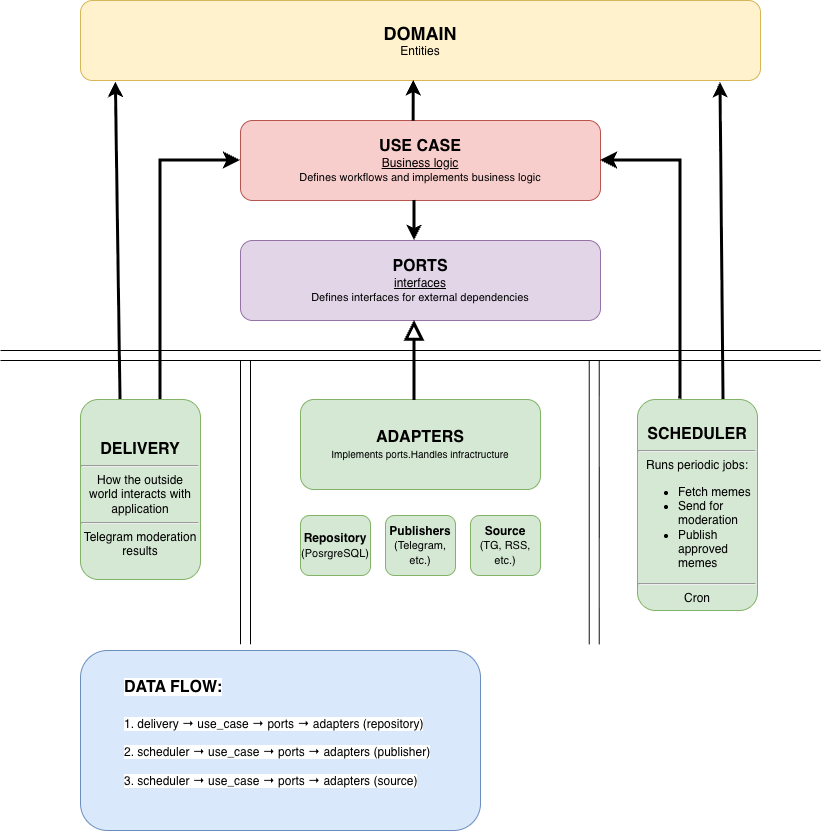

# 📊 Project Architecture Documentation

## 📁 Project Structure

This project follows widely adopted Go convention:
[golang-standards/project-layout](https://github.com/golang-standards/project-layout)

```plaintext
project/  
├── cmd/                     # Application entry points
│   ├── main.go              # Main app (Telegram bot / webhook handler)
├── internal/                # Private application code (not importable outside)
│   ├── domain/              # Core entities and business rules
│   │   └── ...
│   ├── use_case/            # Application business logic (orchestration)
│   │   └── ...
│   ├── ports/               # Interfaces (contracts between use cases and adapters)
│   │   └── ...
│   ├── adapters/            # Implementations of ports (repository, publishers, sources)
│   │   └── ...
│   ├── delivery/            # Input layer (Telegram moderation handler, etc.)
│   │   └── ...
│   ├── scheduler/           # Job definitions (fetch, moderate, publish memes)
│   │   └── ...
│   ├── config/              # Application configuration logic
│   │   └── ...
│   ├── mocks/               # Common test mocks
│   │   └── ...
│   └── util/                # Utilities and helpers
│       └── ...
├── scripts/                 # Build / deploy / maintenance scripts
│   ├── git_hooks_init.sh
│   └── ...
├── docs/                    # Documentation (architecture, diagrams)
│   └── ...
├── go.mod
├── go.sum
└── README.md
```

## 📦 Architecture Layers & Responsibilities



1. Domain Layer (domain)
   * Contains entities and core business rules
   * No dependencies on other layers
   * Pure Go
2. Use Case Layer (use_case)
   * Implements application-specific business logic
   * Orchestrates workflows (e.g., meme moderation, publishing)
   * Depends only on domain
   * interacts with adapters via interfaces located in ports directory
3. Adapters Layer (adapters)
   * Implements interfaces from ports
    Includes:
     - repository
     - source
     - publisher
4. Delivery Layer (delivery)
   * Entry point for external systems
     -  Receiving moderation results
5. Scheduler (scheduler)
   * Runs background jobs:
     - fetching memes
     - sending for moderation
     - publishing approved memes
     
   